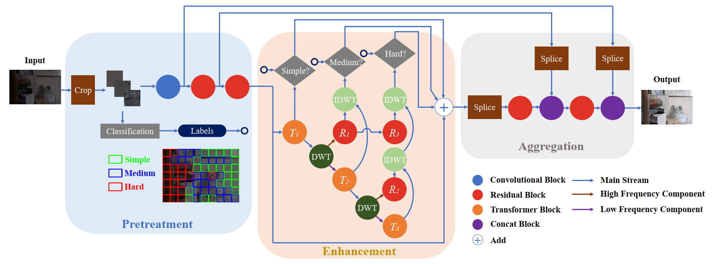

# CSPN: A Category-specific Processing Network for Low-light Image Enhancement
The official pytorch implementation of the paper CSPN: A Category-specific Processing Network for Low-light Image Enhancement

## Framework


## Requirements
pip install -r requirement.txt

## Training
1. Modify the path of the low-light dataset in file `get_algorithm_para.py`, and then run `get_algorithm_para.py` to get the values of the mean and variance of three Gaussian distribution.
2. Copy the values to the file `train.py` and modify the corresponding args, and run `train.py` to train the model from scratch.

## Test
Modify the args and run the file `test.py`.

## Citation
If CSPN helps your research or work, please consider citing this paper.

```
@article{cspn,
  title={CSPN: A Category-specific Processing Network for Low-light Image Enhancement},
  author={Wu, Hongjun and Wang, Chenxi and Tu, Luwei and Patsch, Constantin and Jin, Zhi},
  journal={IEEE Transactions on Circuits and Systems for Video Technology},
  year={2024},
  publisher={IEEE}
}
```

## Contact
If you have any questions, please contact [wuhj33@mail2.sysu.edu.cn](wuhj33@mail2.sysu.edu.cn)
